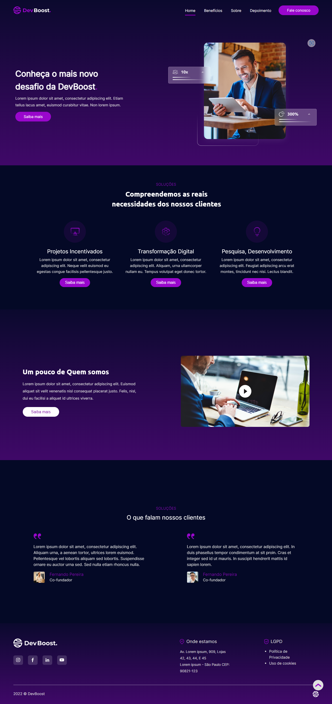

# Desafio DevBoost 3 LandingPage

## Sobre o projeto:
Desafio proposto pela [DevBoost.](https://www.instagram.com/Dev_Boost/)

[🔗 Clique aqui para acessar](https://desafio-dev-boost3-landing-page.vercel.app/)

## 🛠 Tecnologias:
- HTML
- CSS
- JavaScript
- Lib [ScrollReveal.js](https://www.bing.com/ck/a?!&&p=7d9a0d8944bec296JmltdHM9MTY3MzQ4MTYwMCZpZ3VpZD0zZWRkN2EyZi1kMjMzLTYxYWQtMmVmZi02OGEyZDM1ODYwYjgmaW5zaWQ9NTE3OA&ptn=3&hsh=3&fclid=3edd7a2f-d233-61ad-2eff-68a2d35860b8&psq=scroll+reveal+js&u=a1aHR0cHM6Ly9zY3JvbGxyZXZlYWxqcy5vcmcv&ntb=1)

## 🔖 Layout

Você pode visualizar o layout do projeto através [DESSE LINK](https://www.figma.com/file/rYBqcSF8x7VsfBCz2cosF4/Challenge---DevBoost?node-id=11%3A2). É necessário ter conta no [Figma](https://figma.com) para acessá-lo.